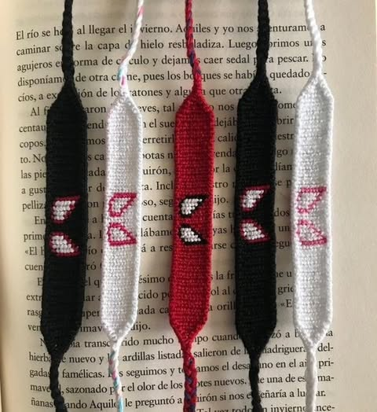

# 🛍️ WollyWay - Handcrafted Accessories E-commerce

A modern, responsive frontend e-commerce platform for handcrafted accessories built with React, TypeScript, and Tailwind CSS. **First Public Release** - Streamlined for core e-commerce functionality.



## ✨ Features

### 🛒 **E-commerce Core**

- **Product Browsing** - Browse handcrafted accessories with beautiful galleries
- **Smart Search** - Find products with advanced filtering and search
- **Shopping Cart** - Add, remove, and manage cart items with local storage
- **Wishlist** - Save favorite products for later
- **Product Bundles** - Special bundle offers and discounts
- **Size Guide** - Interactive size guide for perfect fits

### 👤 **User Experience**

- **User Authentication** - Login, register, and profile management (UI only)
- **User Dashboard** - Order history and account management
- **Order Tracking** - Track order status and shipping
- **Product Reviews & Ratings** - Customer feedback system (UI only)

### 🎨 **Modern UI/UX**

- **Responsive Design** - Mobile-first, works on all devices
- **Smooth Animations** - Framer Motion powered interactions
- **Progress Indicators** - Visual feedback throughout the app
- **WollyWay Branding** - Beautiful color palette and consistent design
- **Toast Notifications** - User feedback and alerts
- **Loading States** - Skeleton loaders and progress bars

## 🚀 Tech Stack

### **Frontend**

- **React 18** - Modern React with hooks and context
- **TypeScript** - Type-safe development
- **Vite** - Fast build tool and development server
- **React Router** - Client-side routing
- **TanStack Query** - Server state management
- **Tailwind CSS** - Utility-first CSS framework
- **Shadcn/ui** - Modern component library
- **Framer Motion** - Smooth animations and transitions
- **Lucide React** - Beautiful icons

### **State Management**

- **React Context** - Global state for cart, auth, wishlist
- **Local Storage** - Persistent data storage
- **Mock Services** - Frontend-only data simulation

### **Development Tools**

- **ESLint** - Code linting and formatting
- **TypeScript** - Static type checking
- **PostCSS** - CSS processing

## 🏁 Getting Started

### **Prerequisites**

- Node.js (v18 or higher)
- npm or yarn package manager

### **Installation**

1. **Clone the repository**

```bash
git clone https://github.com/yourusername/wollyway-wonders.git
cd wollyway-wonders
```

2. **Install dependencies**

```bash
npm install
```

3. **Start development server**

```bash
npm run dev
```

4. **Open your browser**

```
http://localhost:8080
```

### **Available Scripts**

```bash
# Development server
npm run dev

# Build for production
npm run build

# Preview production build
npm run preview

# Lint code
npm run lint
```

## 📁 Project Structure

```
├── public/                 # Static assets and images
│   ├── lovable-uploads/   # Product images and assets
│   └── favicon.ico        # Site favicon
├── src/
│   ├── components/        # Reusable UI components
│   │   ├── ui/           # Shadcn/ui components
│   │   ├── product/      # Product-related components
│   │   ├── order/        # Order management components
│   │   ├── auth/         # Authentication components
│   │   └── user/         # User dashboard components
│   ├── contexts/         # React context providers
│   │   ├── AuthContext.tsx      # User authentication
│   │   ├── CartContext.tsx      # Shopping cart
│   │   └── WishlistContext.tsx  # User wishlist
│   ├── hooks/            # Custom React hooks
│   ├── pages/            # Page components
│   ├── services/         # Mock data services
│   ├── types/            # TypeScript type definitions
│   ├── data/             # Mock JSON data
│   └── lib/              # Utility functions
├── tailwind.config.ts    # Tailwind configuration
├── vite.config.ts        # Vite configuration
└── package.json          # Dependencies and scripts
```

## 🎨 Design System

### **Color Palette**

- **Primary**: Magenta to Pink gradient (`#79084C` → `#FE95F6`)
- **Secondary**: Soft blush (`#F9D6E2`)
- **Accent**: Purple highlights
- **Neutral**: Modern grays for text and backgrounds

### **Typography**

- **Headings**: Bold, gradient text for branding
- **Body**: Clean, readable sans-serif
- **UI**: Consistent sizing and spacing

### **Components**

- **Buttons**: Rounded, with hover effects
- **Cards**: Subtle shadows and borders
- **Forms**: Clean inputs with validation
- **Navigation**: Sticky header with search

## 🔧 Configuration

### **Tailwind CSS**

The project uses a custom Tailwind configuration with:

- Custom colors for WollyWay branding
- Extended spacing and typography
- Animation utilities
- Component variants

### **Vite Configuration**

- Path aliases (`@/` for `src/`)
- React SWC for fast compilation
- Development server on port 8080
- Build optimization

## 🌟 Key Features Showcase

### **Homepage Hero**

Beautiful gradient text with "Uniquely Crafted Accessories" and animated call-to-action buttons.

### **Product Gallery**

Interactive image galleries with zoom, multiple views, and smooth transitions.

### **Shopping Cart**

Real-time cart updates with quantity controls, price calculations, and checkout flow.

### **Responsive Design**

Mobile-first approach ensuring perfect experience on all devices.

### **Performance**

- Optimized images and assets
- Lazy loading for better performance
- Smooth animations without janky motion

## 📱 Mobile Experience

- **Touch-friendly** - Large tap targets and gestures
- **Fast loading** - Optimized for mobile networks
- **Intuitive navigation** - Easy browsing and shopping
- **Responsive images** - Perfect display on all screen sizes

## 🚀 Deployment

### **Build for Production**

```bash
npm run build
```

### **Deploy to Vercel**

```bash
# Install Vercel CLI
npm i -g vercel

# Deploy
vercel
```

### **Deploy to Netlify**

1. Build the project: `npm run build`
2. Upload the `dist` folder to Netlify
3. Configure redirects for SPA routing

## 📋 First Public Release

### **✅ Included Features**

**Core Pages:**

- Home Page - Landing page with hero, featured products, collections
- Shop Page - Product browsing with filters and search
- Product Detail Page - Individual product view
- Cart Page - Shopping cart management
- Checkout Page - Mock checkout process
- Wishlist - Saved products
- User Dashboard/Profile - Basic order history + wishlist
- Contact Page - Contact form (UI only)

**Core Functionality:**

- Product Filtering & Sorting
- Product Search
- Responsive Design (mobile-first)
- WollyWay Branding (colors, cozy knitted theme)
- Smooth Animations & Transitions (Framer Motion)
- Social Login Buttons (UI placeholders)
- Product Reviews & Ratings (UI only, static data)
- Payment Gateway UI (placeholders for Stripe/PayPal)

### **❌ Removed for First Release**

- Recently Viewed Products
- Product Comparison
- Dark/Light Mode Toggle
- About/Founder Story Page
- Blog/Community/Newsletter
- Advanced Product Customization
- Advanced Admin Panel

## 🔮 Future Enhancements

- **Backend Integration** - Real API endpoints and database
- **Payment Processing** - Stripe/PayPal integration
- **User Authentication** - Real login/register functionality
- **Recently Viewed** - Product browsing history
- **Product Comparison** - Side-by-side product comparison
- **Dark Mode** - Light/dark theme toggle
- **Blog/Community** - Content management system
- **Advanced Customization** - Product personalization tools
- **Admin Panel** - Store management dashboard
- **PWA Features** - Offline support and app-like experience
- **Analytics** - User behavior tracking
- **SEO Optimization** - Meta tags and structured data
- **Accessibility** - WCAG compliance improvements
- **Internationalization** - Multi-language support

## 🤝 Contributing

1. Fork the repository
2. Create a feature branch: `git checkout -b feature/amazing-feature`
3. Commit changes: `git commit -m 'Add amazing feature'`
4. Push to branch: `git push origin feature/amazing-feature`
5. Open a Pull Request

## 📄 License

This project is licensed under the MIT License - see the [LICENSE](LICENSE) file for details.

## 💫 Acknowledgments

- **Shadcn/ui** for beautiful component library
- **Tailwind CSS** for styling system
- **Framer Motion** for smooth animations
- **Lucide React** for consistent icons

---

**Built with ❤️ for crafted accessory lovers everywhere**

_WollyWay - Where every accessory tells a story_
