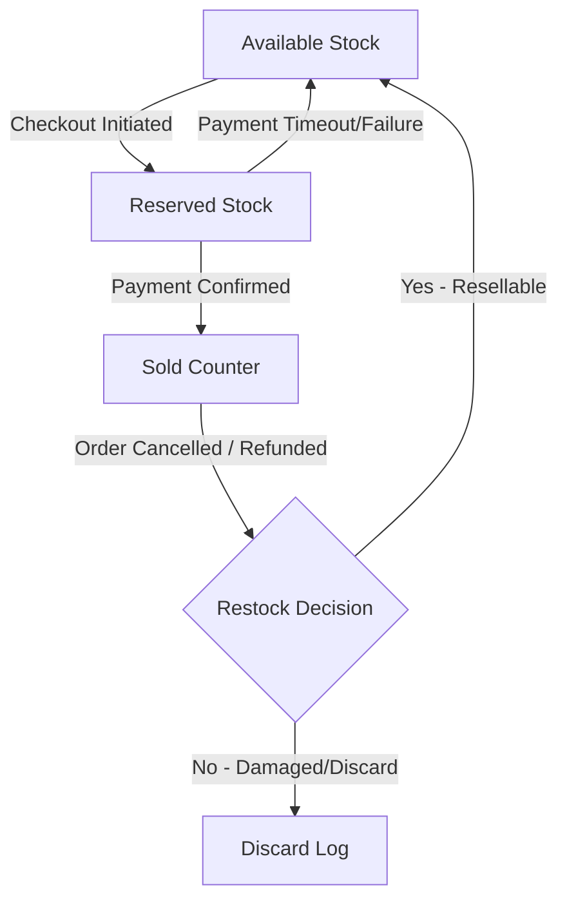

# Architecture: Inventory Lifecycle

This document defines the lifecycle flow of product inventory from creation to sales, locks, cancellations, and refunds.

---

## 1. Stock Movement Diagram

---

## 2. State Mapping Details

### 1. Checkout (Reservation Phase)
* **Trigger**: Customer clicks "Place Order" or enters payment gate checkout sequence.
* **Database Action**: Atomic increment operation transferring the quantity from the available pool:
  * `available` decreases by `N`.
  * `reserved` increases by `N`.
  * *Constraint*: Aborts if `available - N < 0`.
* **Lock Expiry**: The lock persists for `RESERVATION_TIMEOUT_MINUTES`. If payment is not confirmed within this window, a background task releases the lock:
  * `reserved` decreases by `N`.
  * `available` increases by `N`.

### 2. Payment Success
* **Trigger**: Payment webhook confirms funds captured successfully.
* **Database Action**:
  * `reserved` decreases by `N`.
  * `sold` increases by `N`.

### 3. Refunds & Restocking
* **Trigger**: Refund processed for returned items.
* **Database Action**: Returns are not automatically restocked. An admin must evaluate condition:
  * **If resellable**: Increment `available` by returned quantity.
  * **If damaged/discarded**: Do not adjust `available`. Log transaction under `Damage` or `Shrinkage`.

---

## 3. Configuration Parameters
* `RESERVATION_TIMEOUT_MINUTES`: Centralized config variable specifying checkout lock durations.
