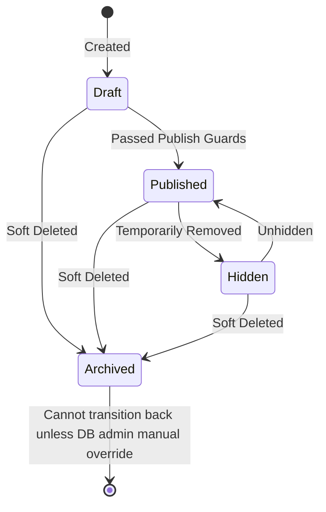

# Product Visibility Lifecycle

In WollyWay, a product flows through a strict state machine to govern its visibility.

## The State Machine

## State Definitions

### 1. Draft
- **Description**: Work in progress.
- **Constraints**: Allowed to have missing critical fields (like price or primary image).
- **Visibility**: Excluded from all customer-facing APIs and Search. Only visible in Admin panels.

### 2. Published
- **Description**: Fully active and live on the storefront.
- **Constraints**: Must pass all **Publish Guards**:
  - `price` must be $\ge$ 0
  - `categoryId` must be set and valid
  - `images` must contain EXACTLY ONE `isPrimary = true`
- **Visibility**: Visible on category pages, search results, and purchasable by customers.
- **Immutability Lock**: Once published, the `slug` cannot be changed via standard updates to prevent breaking SEO links across the internet.

### 3. Hidden
- **Description**: Fully validated but temporarily removed from catalog browsing (e.g., Seasonal Christmas items hidden in July).
- **Constraints**: Still must pass publish guards.
- **Visibility**: Excluded from Search and Category listings. Can be accessed via direct URL by a customer (to preserve SEO index juice and user bookmarks) but cannot be added to cart.

### 4. Archived
- **Description**: Soft-deleted.
- **Constraints**: 
  - Cannot be purchased.
  - Retained in the database forever because past orders rely on the document for referential integrity.
  - A product cannot be archived if it has active, unsettled orders pending.
- **Visibility**: Hidden from ALL public APIs.
- **Reversion**: **A product cannot transition back from Archived** unless explicitly restored by an administrator via manual override.
