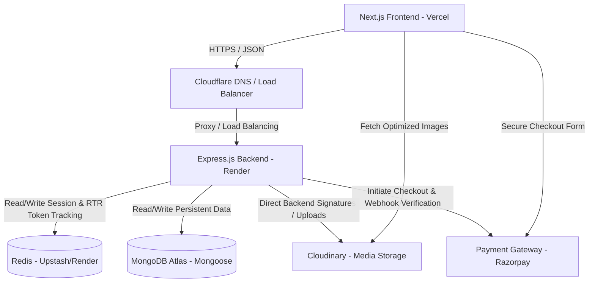

# WollyWay - Backend Architecture Blueprint

This document defines the backend architecture blueprint for **WollyWay**, a production-grade, single-vendor handcrafted woollen e-commerce platform. It outlines the design principles, structural directories, security layers, storage schemes, and deployment structures required to build a highly maintainable, scalable, and secure system.

---

## 1. High-Level System Architecture

The WollyWay system utilizes a decoupled, modern multi-tier architecture. Below is the interaction model showing communication pathways and protocols between the system components.



### Communication & Interaction Details
1. **Frontend to Backend (HTTPS)**: All client-backend interactions are standard REST APIs running over HTTPS. Authentication is managed using HTTP-Only `Secure` cookies carrying JSON Web Tokens (JWTs) to mitigate Cross-Site Scripting (XSS) risks.
2. **Backend to MongoDB (Mongoose)**: Express connects to MongoDB Atlas using connection pooling. Mongoose models define schema validation, triggers/hooks (e.g., auto-slug generation), and database constraints.
3. **Backend to Redis (Cache / Session / Rate Limit)**: Redis handles highly transactional read/write workloads:
   - **Rate Limiting**: Stores temporary client IP request metrics.
   - **Data Caching**: Caches catalog listing results and active bundles.
   - **Token Tracking**: Stores active session refresh token hashes for verification and rotation check.
4. **Backend to Cloudinary (Asset Signatures & Management)**: The backend provides signed upload parameters to allow the frontend to upload media directly to Cloudinary safely, avoiding backend bandwidth choking. The backend also executes programmatic deletions.
5. **Backend to Payment Gateway (Webhooks & Transactions)**: The payment lifecycle is initiated by the backend returning a secure checkout session ID / order ID to the client. Razorpay issues asynchronous Webhook notifications to the backend to securely transition payment statuses to `Completed` or `Failed`.

---

## 2. Backend Folder Structure

A modular, layered structure organized by concerns ensures the codebase remains maintainable as features expand.

```
wollyway-backend/
├── .github/                  # GitHub Actions CI/CD workflows
├── docs/                     # Technical specifications and API docs (OpenAPI)
├── src/
│   ├── config/               # Environment variable schemas & initializers
│   ├── constants/            # Centralized constants (HTTP statuses, enums, cookies)
│   ├── controllers/          # HTTP request handlers & response orchestration
│   ├── middlewares/          # Security, auth, and error-handling middlewares
│   ├── models/               # Mongoose schemas and interface definitions
│   ├── routes/               # Express routing logic organized by versions
│   ├── seed/                 # Database seed scripts (products, categories, admin user)
│   ├── services/             # Core business logic layer (payment validation, inventory)
│   ├── types/                # TS interfaces and custom declarations
│   ├── utils/                # Helpers (JWT, math precision, hashing)
│   ├── validators/           # Zod schemas for payload validation
│   └── app.ts                # Express application definition
├── tests/                    # Unit, Integration, and E2E test suites
├── .env.example              # Template for environment variables
├── Dockerfile                # Multi-stage build specification
├── docker-compose.yml        # Local development orchestrator
├── package.json              # Package metadata and scripts
└── tsconfig.json             # TypeScript compiler settings
```

### Purpose of Folders
* **`config/`**: Ensures external dependencies (databases, providers) are loaded with validated configurations. Zero direct usage of `process.env` outside this directory.
* **`constants/`**: Unified dictionary of HTTP status codes, User Roles, system permissions, Cookie settings, and Redis namespace keys.
* **`controllers/`**: Extracts incoming path parameters, query params, and payloads. Translates them into structured calls for the services, and builds the standardized JSON API response.
* **`services/`**: The core repository of business rules. This layer interacts with Mongoose Models to fetch or update data, handles transactions, and performs Razorpay integrations.
* **`models/`**: Declares MongoDB collections, indexes, and custom schema triggers.
* **`routes/`**: Handles the URL path routing matching. Maps API versions (e.g., `v1`) to specific endpoints.
* **`seed/`**: Contains execution scripts to initialize databases with core categories, starter products, and a default root administrator user.
* **`validators/`**: Hosts schemas that enforce request shape before the request reaches the controller logic.

---

## 3. Request Lifecycle

The request lifecycle is structured to fail fast, verifying format, limits, and auth permissions before executing database operations or business logic.

```
[Incoming HTTP Request]
         │
         ▼
[Global Middlewares] (Helmet, CORS, JSON Parsers)
         │
         ▼
[Request ID Middleware] (Attach unique X-Request-ID header)
         │
         ▼
[Rate Limiter] (IP-based lookup via Redis)
         │
         ▼
[Express Router] (Endpoint routing match)
         │
         ▼
[Auth / RBAC Middleware] (JWT verification and permission check)
         │
         ▼
[Zod Validator Middleware] (req.body, req.query, and req.params parsing)
         │
         ▼
[Controller Handler] (Param extraction & service orchestration)
         │
         ▼
[Service Layer] (Core business execution & logic rules)
         │
         ├──────────────────────────────────┐
         ▼                                  ▼
  [Cache Manager (Redis)]            [Mongoose Models]
(Check for catalog cache hits)    (Database CRUD operations)
         │                                  │
         └────────────────┬─────────────────┘
                          │
                          ▼
              [JSON Success Response]
                          │
        (If Error Occurs, throw to Catch block)
                          │
                          ▼
            [Global Error Middleware]
```

---

## 4. Layered Architecture Roles

| Layer | Responsibility | What it does NOT do |
| :--- | :--- | :--- |
| **Routes** | Binds URI patterns to specific validators, controllers, and authorization decorators. | Execute database checks or business validations. |
| **Validators** | Inspect type declarations, string formats, payload sizes, and mandatory fields using Zod schemas. | Interrogate state databases (e.g., checking if email is duplicate). |
| **Middlewares** | Handle request context transformations (IP tracking, authorization headers, request ID generation). | Return direct domain success responses. |
| **Controllers** | Act as the entry gateway for routes. Extract payload elements and map them into functions for the Service layer. | Run raw MongoDB query logic or database updates. |
| **Services** | Implement the core business rules. Calculate prices, coordinate inventory states, and interact with Razorpay. | Handle Express-specific parameters (`req`, `res`, `next`). |
| **Models** | Map data properties to DB schemas. House indexes, validators, and auto-timestamps. | Execute controller or routing operations. |

---

## 5. Configuration Strategy

A robust backend relies on strict validation of configurations at startup. We propose a Zod-validated configuration file structure in `src/config/`.

### Config Schema (`src/config/env.config.ts`)
```typescript
import { z } from 'zod';
import dotenv from 'dotenv';

dotenv.config();

const envSchema = z.object({
  NODE_ENV: z.enum(['development', 'production', 'test']).default('development'),
  PORT: z.coerce.number().default(5000),
  MONGO_URI: z.string().url(),
  REDIS_URI: z.string().url(),
  JWT_ACCESS_SECRET: z.string().min(32),
  JWT_REFRESH_SECRET: z.string().min(32),
  CLOUDINARY_CLOUD_NAME: z.string(),
  CLOUDINARY_API_KEY: z.string(),
  CLOUDINARY_API_SECRET: z.string(),
  RAZORPAY_KEY_ID: z.string(),
  RAZORPAY_KEY_SECRET: z.string(),
  RAZORPAY_WEBHOOK_SECRET: z.string(),
  CORS_ORIGIN: z.string().url(),
});

const parsedEnv = envSchema.safeParse(process.env);

if (!parsedEnv.success) {
  console.error('❌ Invalid environment variables configuration:', parsedEnv.error.format());
  process.exit(1);
}

export const env = parsedEnv.data;
```

---

## 6. Request Correlation & Logging Strategy

Logging is organized to supply detailed debug context during local development while transmitting structured, aggregate metrics in production.

### Request ID Correlation Middleware
Every incoming request passes through a correlation middleware that ensures log traceablity:
- Generates a unique UUID (v4) for each incoming request.
- Attaches the identifier to the response headers as `X-Request-ID` and logs it.
- Binds the identifier to the request context to tag downstream application, database, and database transition logs.

```typescript
import { Request, Response, NextFunction } from 'express';
import { v4 as uuidv4 } from 'uuid';

export const requestIdMiddleware = (req: Request, res: Response, next: NextFunction) => {
  const requestId = req.headers['x-request-id'] || uuidv4();
  req.id = requestId as string; // typed override in src/types/express.d.ts
  res.setHeader('X-Request-ID', requestId);
  next();
};
```

* **Logger Engine**: `Pino` is preferred for low-latency JSON stdout formatting, configured to automatically append the request correlation ID (`reqId`) to all logged lines.
* **Log Output Format**:
  - **Development**: Clean, human-readable colorized strings with UUID tag.
  - **Production**: Standard single-line structured JSON.
* **Logging Targets**:
  - **Pino-http**: Auto-logs request method, status, response time, and correlation ID.
  - **Error Logs**: Explicit stack traces correlated with the request ID.
* **Log Levels**: `error`, `warn`, `info`, `debug`.

---

## 7. Error Handling Strategy

Errors must be categorized, avoiding leaks of database internals (like Mongoose stack traces) to the frontend.

### Error Classification
1. **Operational Errors (AppError)**: Foreseen errors, such as validation failures, out of stock, unauthorized access, or resource not found.
2. **Unexpected Errors (System Errors)**: Unplanned failures, such as memory exhaustion or database connection losses.

### Custom Error Base Class (`src/utils/AppError.ts`)
```typescript
export class AppError extends Error {
  public readonly statusCode: number;
  public readonly isOperational: boolean;
  public readonly details: any;

  constructor(message: string, statusCode: number, details: any = null) {
    super(message);
    this.statusCode = statusCode;
    this.isOperational = true;
    this.details = details;
    Error.captureStackTrace(this, this.constructor);
  }
}
```

### Global Error Handling Middleware (`src/middlewares/errorHandler.ts`)
```typescript
import { Request, Response, NextFunction } from 'express';
import { AppError } from '../utils/AppError';
import { env } from '../config/env.config';

export const errorHandler = (
  err: Error | AppError,
  req: Request,
  res: Response,
  next: NextFunction
) => {
  let statusCode = 500;
  let message = 'Something went wrong';
  let errors: any[] = [];

  if (err instanceof AppError) {
    statusCode = err.statusCode;
    message = err.message;
    errors = err.details || [];
  } else if (err.name === 'ValidationError') {
    statusCode = 400;
    message = 'Validation Error';
  } else if (err.name === 'MongoServerError' && (err as any).code === 11000) {
    statusCode = 409;
    message = 'Duplicate field value entered';
  }

  res.status(statusCode).json({
    success: false,
    message,
    errors,
    requestId: req.id, // Correlated Request ID
    ...(env.NODE_ENV === 'development' && { stack: err.stack }),
  });
};
```

---

## 8. Validation Strategy

For validation, we recommend **Zod** because of its TypeScript Type Inference and robust error formatting.

### Integration Middleware (`src/middlewares/validate.ts`)
```typescript
import { Request, Response, NextFunction } from 'express';
import { AnyZodObject, ZodError } from 'zod';
import { AppError } from '../utils/AppError';

export const validate = (schema: AnyZodObject) => {
  return async (req: Request, res: Response, next: NextFunction) => {
    try {
      const parsed = await schema.parseAsync({
        body: req.body,
        query: req.query,
        params: req.params,
      });
      req.body = parsed.body;
      req.query = parsed.query;
      req.params = parsed.params;
      next();
    } catch (error) {
      if (error instanceof ZodError) {
        const issues = error.issues.map((issue) => ({
          field: issue.path.slice(1).join('.'),
          message: issue.message,
        }));
        next(new AppError('Validation failed', 400, issues));
      } else {
        next(error);
      }
    }
  };
};
```

---

## 9. Authentication & Token Rotation Strategy

WollyWay's authentication system uses a highly secure, stateless JWT-based refresh token rotation (RTR) model.

```
       [Client Login Request]
                 │
                 ▼
     [Backend Validates Credentials]
                 │
                 ▼
[Generate Access Token (JWT - 15m)]
[Generate Refresh Token (JWT - 7d)]
                 │
                 ▼
[Set Refresh Token in HTTP-only Cookie]
[Return Access Token in JSON Payload]
                 │
                 ├────────────────────────┐
                 ▼                        ▼
     [Store RT Hash in Redis/DB]   [Client Saves AT in Memory]
```

### Refresh Token Rotation Details
* **Hashed Storage**: Active refresh tokens are hashed and stored in Redis/Database against the User's ID.
* **Rotation**: When a client requests a new Access Token using their Refresh Token:
  1. The backend verifies the signature and validates the token hash against the stored active record.
  2. On validation success, the old Refresh Token is invalidated/deleted, and a new Refresh Token + Access Token pair is generated.
  3. The new Refresh Token hash is stored, and the new cookie is returned to the client.
* **Reuse Detection**: If an old (invalid/rotated) Refresh Token is submitted, it implies a token leak has occurred. The backend immediately invalidates the entire token family (deleting all active session refresh tokens associated with that user ID) forcing a complete log out.

---

## 10. Database & Inventory Strategy (MongoDB & Mongoose)

MongoDB provides WollyWay with document flexibility. We enforce relationships, transaction patterns, and index schemes to protect data integrity.

### Data Models & Embedded Structures
* **Users**: Identity, roles, addresses.
  - **Embedded Cart**: Carts are embedded as an array inside the User document:
    ```typescript
    cart: [{ productId: mongoose.Schema.Types.ObjectId, quantity: Number }]
    ```
  - **Embedded Wishlist**: Wishlists are embedded as an array inside the User document:
    ```typescript
    wishlist: [mongoose.Schema.Types.ObjectId]
    ```
* **Products**: Specifications, price history, slug, status (`draft`, `published`, `archived` - *no soft deletes*), and stock metrics.
* **Orders**: Purchase records with embedded snapshot of item details.
* **Reviews**: Reviews are stored in a separate collection referencing `userId` and `productId` for pagination. Supports `text`, `rating` (1-5), and an `image` (optional).

### Inventory Strategy Lifecycle
To handle handcrafted woollen inventory accurately:

```
[Available Stock] ──(Checkout Initiated)──> [Reserved Stock]
       │                                           │
       │                                 (Payment Completed)
       │                                           │
(Released on Timeout/Fail)                         ▼
       └───────────────────────────────────── [Sold Stock]
```

1. **Available**: Product stock ready for purchase.
2. **Reserved**: When checkout begins, inventory is temporarily locked. The reserved items are tracked in Redis with a Time-To-Live (TTL) of 15 minutes.
3. **Sold**: Upon a successful payment webhook response from Razorpay, the reserved stock is finalized, and available stock is permanently decremented.
4. **Released**: If checkout fails or the 15-minute reservation expires, the reserved items are returned back to the `Available` stock pile.

### Search Strategy
* **Text Indexing**: Initial search is powered by MongoDB text indexes on product fields:
  ```typescript
  ProductSchema.index({ name: 'text', description: 'text', tags: 'text' });
  ```
* **Atlas Search**: If advanced search capabilities (fuzzy matching, typeahead, autocomplete) are required later, the system will scale to use Lucene-based MongoDB Atlas Search.

### Pagination Standard
Every catalog/listing route must enforce a standardized pagination parameter format:
`GET /api/v1/products?page=1&limit=12&sort=-createdAt&category=hair-accessories`

Response contains pagination metadata inside `meta`:
```json
"meta": {
  "totalItems": 48,
  "totalPages": 4,
  "currentPage": 1,
  "limit": 12
}
```

---

## 11. Caching Strategy (Redis)

Redis is deployed to offload heavy read operations from MongoDB and support session and access control services.

### Core Caching Cases
1. **Product Catalog Cache**: Home page categories and the top-tier product queries are cached via a **Cache-Aside** strategy. Key structure: `wollyway:products:catalog:page:1`.
2. **RTR Session Store**: Caches active refresh token hashes for session validation.
3. **Inventory Reservation**: Tracks temporary reservations (15-min TTL) during checkouts.

---

## 12. Media Upload Strategy (Cloudinary)

To optimize storage costs and performance, the application defines strict media guidelines:
* **Single Source File**: Store only **one high-resolution original image** in Cloudinary.
* **Dynamic Transformations**: Utilize Cloudinary's dynamic URL parameters to transform images on-the-fly for client requests (e.g., fetching a 300x300 thumbnail):
  `https://res.cloudinary.com/wollyway/image/upload/w_300,h_300,c_fill,q_auto,f_auto/v1/products/item.jpg`

### File Upload Limits & Constraints
To ensure resource security and prevent denial of service (DoS) via huge media uploads, limits are validated before forwarding files:
* **Maximum Image Size**: 5MB per upload.
* **Allowed MIME Types**: Only standard image layers (`image/jpeg`, `image/png`, `image/webp`).
* **Maximum Images Per Product**: 5 images limit to prevent database overload and excessive cloud storage costs.

---

## 13. API & Response Standards

### Health Check Endpoint
To support Render load-balancer probing, container liveness checks, and remote uptime monitoring, the API documents a lightweight health endpoint:
* **Route**: `GET /api/v1/health`
* **Response Payload**:
  ```json
  {
    "success": true,
    "message": "API is healthy",
    "uptime": "14235.12s",
    "timestamp": "2026-07-11T13:00:00.000Z",
    "environment": "production"
  }
  ```

### Success Response Standard
```json
{
  "success": true,
  "message": "Resource retrieved successfully",
  "data": {},
  "meta": {}
}
```

### Error Response Standard
```json
{
  "success": false,
  "message": "Resource not found",
  "errors": [
    {
      "field": "id",
      "message": "Invalid product identifier"
    }
  ]
}
```

---

## 14. Project Constants

Central constants are declared under `src/constants/` to avoid magic strings.

* **HTTP Statuses**: Unified standard mappings (e.g., `OK = 200`, `BAD_REQUEST = 400`, `UNAUTHORIZED = 401`).
* **Roles & Permissions**: Defines user levels (`ADMIN`, `CUSTOMER`).
* **Cookie Names**: Key strings (e.g., `REFRESH_TOKEN_COOKIE = "refreshToken"`).
* **Redis Keys**: Namespace prefixes (e.g., `CATALOG_CACHE_PREFIX = "wollyway:catalog"`).

---

## 15. Seeding Strategy

The project contains a seeding layer inside `src/seed/` with modular scripts:
* **`seed-categories.ts`**: Populates the category hierarchy tree.
* **`seed-products.ts`**: Inserts dummy handcrafted products associated with categories.
* **`seed-admin.ts`**: Creates the primary administrator credentials.
* **Execution**: Triggered via npm script commands: `npm run db:seed`.

---

## 16. Security Strategy

* **Helmet**: Sets secure HTTP response headers.
* **CORS**: Dynamically matches authorized origins.
* **Express Rate Limit**: Prevents DDoS/brute-force attacks via Redis stores.
* **Mongo Sanitize & XSS Clean**: Prevents NoSQL queries and HTML injection.
* **Cookie Security**: HTTP-only, Secure, SameSite=Strict cookies.

---

## 17. Docker Strategy

Multi-stage build process separating builder output from runtime containers.

```dockerfile
# Stage 1: Build compilation
FROM node:20-alpine AS builder
WORKDIR /app
COPY package*.json tsconfig.json ./
RUN npm ci
COPY src ./src
RUN npm run build

# Stage 2: Clean production runtime
FROM node:20-alpine AS runner
WORKDIR /app
ENV NODE_ENV=production
COPY package*.json ./
RUN npm ci --only=production
COPY --from=builder /app/dist ./dist
EXPOSE 5000
CMD ["node", "dist/app.js"]
```

---

## 18. CI/CD Strategy

GitHub Actions runs formatting verification (`Prettier`), lint audits (`ESLint`), compilation builds, and test validations on pull requests before deploying the container update via Render webhooks.
